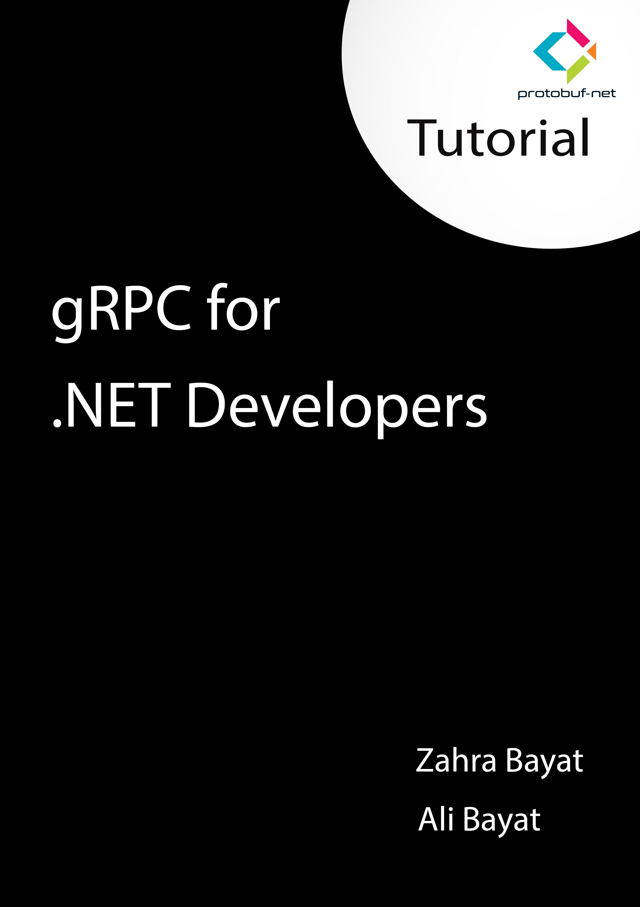

## Give a Star! :star:
If you like this project, learn something or you are using it in your applications, please give it a star. Thanks!

# gRPC for .NET Developers

Welcome to the Git repo that is associated with the book
**[gRPC for .NET Developers](https://github.com/ZahraBayatgh/ProtobufNetGrpc/blob/master/grpc.pdf)**
published by [LinkedIn](https://www.linkedin.com/in/zahrabayat/).
This book show simple gRPC access in .NET using protobuf-net.Grpc library.

This Git repo contains all the code in the book, plus a
[free pdf book](https://github.com/ZahraBayatgh/ProtobufNetGrpc/blob/master/grpc.pdf)

| gRPC for .NET Developers |
| ------------|
|  |  |  |
|  <a href='https://github.com/ZahraBayatgh/ProtobufNetGrpc/blob/master/grpc.pdf'>**Download .PDF**</a> 
